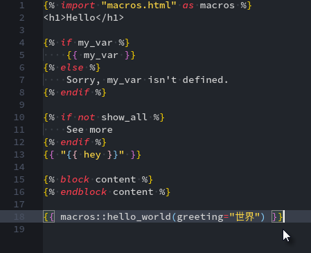

# Tera extension for VS Code

VS Code extension for syntax highlighting and formatting [Tera][tera] templates. Based on https://github.com/danielchatfield/atom-jinja2.

## Features

Syntax highlighting for Tera Template.

## Requirements

Visual Studio Code. Version 1.19.1 as this extension made.

## Snippets

| Snippet | Description                        |
| ------- | ---------------------------------- |
| xx      | `{{ }}`                            |
| block   | ` `       |
| inblock | Same as above but on a single line |
| if      | ` `             |
| ifi     | Same as above but on a single line |
| ifelse  | `  `  |
| else    | ``                       |
| filter  | ` `     |
| forloop | ` `        |
| extend  | ``                 |
| include | ``                 |
| import  | ``                  |
| macro   | ` `       |

## Release Notes

## 0.0.9 - 20201-07-23

- Revert 0.0.8 as it broke down Markdown files

## 0.0.8 - 20201-07-23

- Snippets support in Markdown files
- Syntax highlighting of tera templates in Markdown files

### 0.0.7
- Reregister the `.tera` extension
- Removed the unused dependencies

### 0.0.6

- Tera template file is replaced with HTML for syntax highlighting
- Snippets work in HTML

### 0.0.4

- Added snippets support.

### 0.0.3

- Added formatting support.

### 0.0.1

- First release. May or may not be maintained.

## For more information

- [Tera Template](https://keats.github.io/tera/)
- [Zola](https://github.com/getzola/zola)

**Enjoy!**
