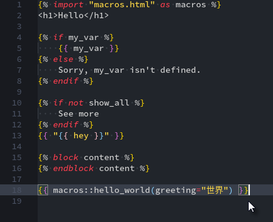

# Tera extension for VS Code

VS Code extension for syntax highlighting and formatting [Tera][tera] templates. Based on https://github.com/danielchatfield/atom-jinja2.

## Features

Syntax highlighting for Tera templates, embedded in 28 host languages (HTML, XML, CSS, JSON,
Markdown, Python, Ruby, JavaScript, TypeScript, YAML, TOML, LaTeX, Rust and more).

Both **Tera 2** and Tera 1 syntax are highlighted. Tera 2 additions include components
(`` / ``), capture blocks (`...`),
optional chaining (`a?.b`), spread (`{...base}`), ternaries, list comprehensions, slicing
and the renamed built-in filters and tests. Tera 1 tags such as `` and
`` are still highlighted so existing templates keep working.

## Requirements

Visual Studio Code 1.91.0 or later.

## Snippets

| Snippet | Description                        |
| ------- | ---------------------------------- |
| xx      | `{{ }}`                            |
| block   | ` `       |
| inblock | Same as above but on a single line |
| if      | ` `             |
| ifi     | Same as above but on a single line |
| ifelse  | `  `  |
| else    | ``                       |
| filter  | ` `     |
| forloop | ` `        |
| extend  | ``                 |
| include | ``                 |
| import  | ``                  |
| macro   | ` ` (Tera 1 only) |

### Tera 2

| Snippet       | Description                                    |
| ------------- | ---------------------------------------------- |
| component     | ` `           |
| comp          | ``                          |
| compbody      | ` `                   |
| set           | ``                                  |
| setglobal     | ``                           |
| setblock      | ` `                       |
| raw           | ` `                       |
| comment       | `{# #}`                                        |
| ternary       | `{{ a if cond else b }}`                       |
| comprehension | ``           |
| break         | ``                                  |
| continue      | ``                               |

## Release Notes

## 0.0.9 - 20201-07-23

- Revert 0.0.8 as it broke down Markdown files

## 0.0.8 - 20201-07-23

- Snippets support in Markdown files
- Syntax highlighting of tera templates in Markdown files

### 0.0.7
- Reregister the `.tera` extension
- Removed the unused dependencies

### 0.0.6

- Tera template file is replaced with HTML for syntax highlighting
- Snippets work in HTML

### 0.0.4

- Added snippets support.

### 0.0.3

- Added formatting support.

### 0.0.1

- First release. May or may not be maintained.

## For more information

- [Tera Template](https://keats.github.io/tera/)
- [Zola](https://github.com/getzola/zola)

**Enjoy!**
